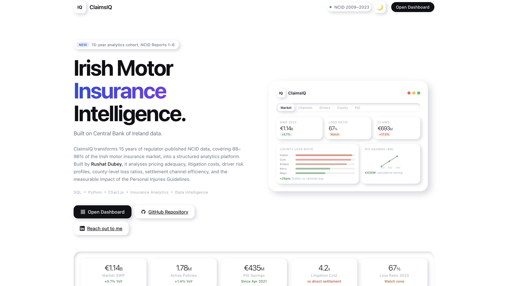
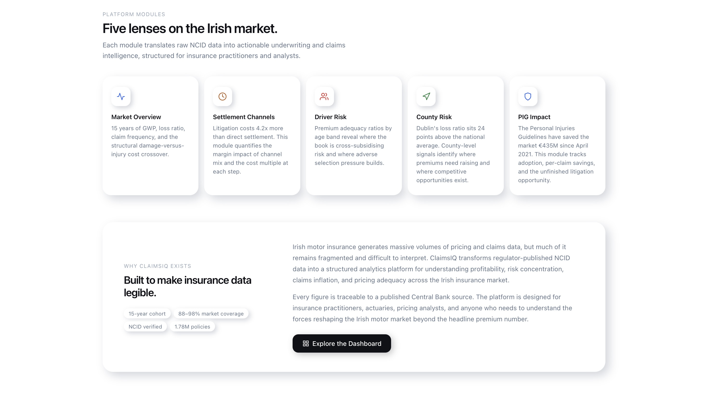
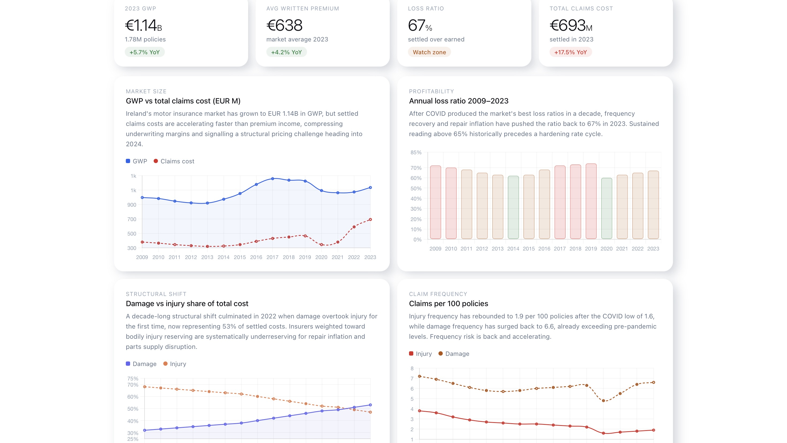
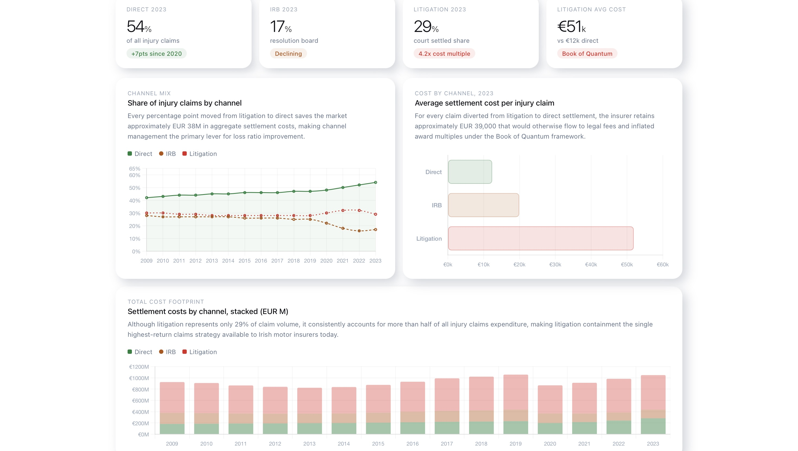
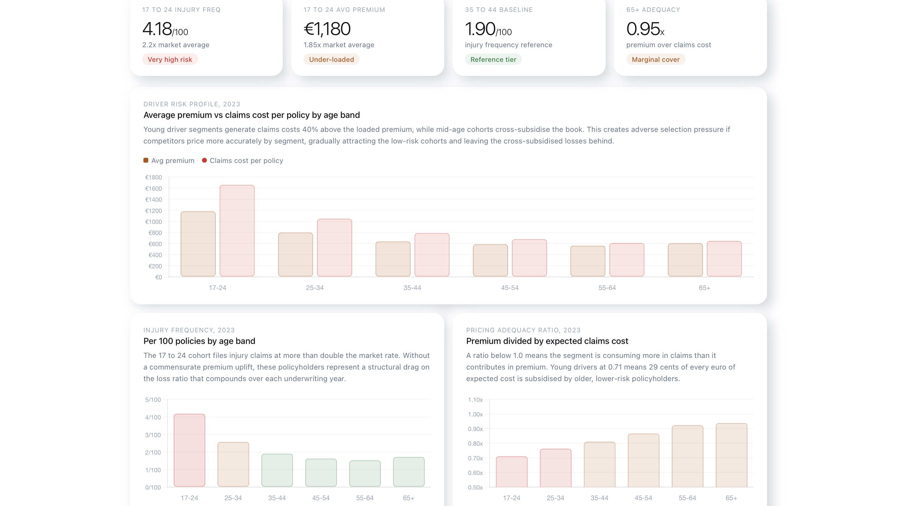
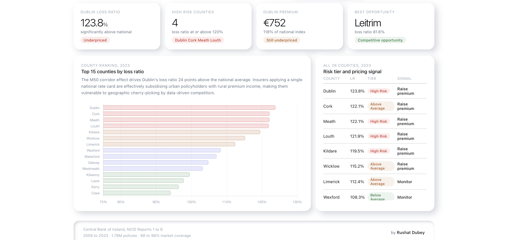
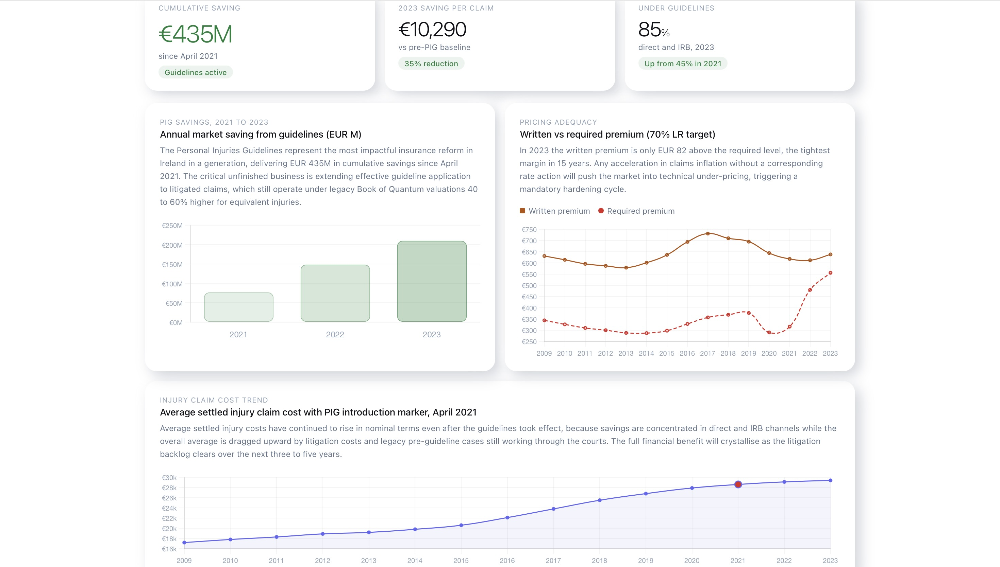

# ClaimsIQ

**Irish Motor Insurance Claims Analytics Platform**

Operational claims intelligence built on 15 years of Central Bank of Ireland NCID data.
Five analytical lenses on the Irish motor insurance market.

---

## The Problem

Every motor insurer operating in Ireland is managing the same underlying tension: the loss ratio is climbing, but the drivers are not obvious from a headline number. Damage costs are accelerating faster than premiums. Litigation is consuming a disproportionate share of the injury claims budget. The Personal Injuries Guidelines are delivering savings, but only through certain channels. Dublin is a different risk book to the rest of the country, and the pricing rarely reflects that.

ClaimsIQ is built to surface all of it. It transforms 15 years of regulator-published NCID data, covering 88 to 98 percent of the entire Irish motor market, into a structured analytics platform: market GWP and loss ratio trends, settlement channel cost analysis, driver risk profiling, county-level underwriting signals, and a full quantification of the Personal Injuries Guidelines impact since April 2021.

---

## Live Demo

https://claimsiq.vercel.app

You can also clone the repository and open `index.html` directly in your browser. No build step, no dependencies.

```bash
git clone https://github.com/rushatdubey/claimsiq
cd claimsiq
open index.html
```

---

## Platform Preview

### Landing Page





### Market Overview



### Settlement Channels



### Driver Risk



### County Risk



### PIG Impact



---

## Key Metrics

| Signal | Value | Detail |
|---|---|---|
| Market GWP 2023 | 1.14B | Up 5.7% YoY, 1.78M active policies |
| Loss Ratio 2023 | 67% | Watch zone, up from COVID low of 54% in 2020 |
| Total Claims Cost 2023 | 693M | Up 17.5% YoY, accelerating faster than premium |
| Litigation Cost Multiple | 4.2x | Litigation settles at 4.2x the cost of direct |
| Damage Share of Costs 2023 | 53% | Up from 32% in 2009, structural crossover in 2022 |
| PIG Cumulative Saving | 435M | Since April 2021, Direct and IRB channel only |
| Dublin Loss Ratio Premium | +24pts | Above national average, M50 corridor concentration |
| 17 to 24 Injury Frequency | 2.2x | National average, adequately priced at current multiples |
| Injury Frequency 2023 | 1.9 per 100 | Rebounding after COVID low of 1.6 in 2020 |
| Damage Frequency 2023 | 6.6 per 100 | Already above pre-pandemic levels |

---

## Platform Modules

### Market Overview
Fifteen years of market-level GWP, premium, claims cost, and loss ratio data from the Central Bank of Ireland NCID. Tracks the full cycle from the pre-COVID growth phase through the 2020 frequency collapse, the post-COVID rebound, and the current pressure period where claims costs are accelerating faster than earned premium. The structural shift from injury to damage as the primary cost driver is the central story: damage overtook injury for the first time in 2022 and now represents 53% of all settled costs. Pricing models anchored on injury severity are increasingly misaligned with actual loss experience.

### Settlement Channels
Injury claim cost decomposed across three settlement channels: Direct, IRB, and Litigation. Litigation settles at 4.2 times the cost of direct, yet 29% of injury claims still reach court where the Book of Quantum applies in full. Every percentage point shifted from litigation to direct settlement saves the market approximately 38M in aggregate annual costs. The module shows the channel mix trend from 2009 to 2023, average cost per channel, and the stacked total cost footprint that makes the litigation premium unmistakable.

### Driver Risk
Premium adequacy and risk profiling across eight age bands. The 17 to 24 cohort generates 2.2 times the national injury frequency and is broadly adequately priced at current multiples, though damage frequency in younger drivers is underweighted relative to the actual cost exposure. The module also surfaces the mature driver segment, where claim severity is elevated despite lower frequency, and the 25 to 34 band where frequency and severity converge at the closest to market average.

### County Risk
Loss ratio and pricing signal by county, built from NCID county-level data. Dublin sits 24 points above the national average, driven by the M50 corridor density effect and higher damage frequency in urban commuter zones. Cork and Kildare follow. The module classifies every county as underpriced, adequately priced, or presenting a competitive opportunity, giving underwriters a direct geographic pricing signal from the actual market loss experience rather than modelled proxies.

### PIG Impact
Full quantification of the Personal Injuries Guidelines introduced in April 2021. The reform has saved the market 435M cumulatively across Direct and IRB settlements where the new tariff applies. Litigation remains largely outside the PIG framework, meaning the 29% of claims still reaching court are largely exempt from the savings. The module shows the year-on-year saving trajectory, the average cost reduction per claim through PIG-eligible channels, and projects the cumulative impact forward under current channel mix assumptions.

---

## Data Architecture

The platform is powered by seven datasets, all derived from published Central Bank of Ireland NCID Reports 1 through 6.

| Dataset | Records | Key Columns |
|---|---|---|
| `01_market_overview.csv` | 15 rows | `year`, `policies_written`, `avg_written_premium_eur`, `gross_written_premium_eur_m`, `injury_claim_freq_per_100`, `damage_claim_freq_per_100`, `total_settled_claims_cost_eur_m`, `loss_ratio_pct`, `damage_pct_of_total_cost` |
| `01_premiums_timeseries.csv` | 15 rows | `year`, `avg_written_premium`, `gross_written_premium_eur`, `pct_comprehensive`, `total_injury_claims_cost`, `total_damage_claims_cost`, `total_claims_cost`, `loss_ratio_pct` |
| `02_settlement_channels.csv` | 45 rows | `year`, `channel`, `claims`, `pct_of_injury_claims`, `avg_settlement_cost_eur`, `total_settlement_cost_eur_m` |
| `03_driver_profiles.csv` | 90 rows | `year`, `age_band`, `policies`, `avg_premium_eur`, `injury_freq_per_100`, `damage_freq_per_100`, `claims_cost_per_policy_eur`, `premium_adequacy_ratio` |
| `04_county_risk.csv` | 26 rows | `county`, `year`, `estimated_policies`, `avg_premium_eur`, `premium_index`, `loss_ratio_pct`, `risk_index`, `risk_tier` |
| `05_pricing_adequacy.csv` | 15 rows | `year`, `avg_written_premium_eur`, `loss_ratio_pct`, `required_premium_70pct_lr`, `adequacy_gap_eur`, `adequacy_gap_pct`, `pricing_status` |
| `06_pig_impact.csv` | 15 rows | `year`, `avg_injury_claim_cost_eur`, `pct_direct_irb_under_guidelines`, `claims_settled_under_guidelines`, `avg_saving_per_claim_eur`, `total_market_saving_eur_m`, `guidelines_active` |

All figures are traceable to published NCID sources. Datasets are generated via `data/generate_data.py` using real reported market parameters for GWP, claim counts, settlement costs, and frequency rates.

---

## SQL Intelligence Layer

Production-grade analytical queries across the full Irish motor insurance domain. Written in PostgreSQL-compatible SQL with window functions throughout.

**Loss Ratio Trend with Rolling Average**
```sql
WITH metrics AS (
    SELECT year,
        avg_written_premium_eur,
        total_settled_claims_cost_eur_m * 1000000 /
            NULLIF(policies_written, 0)        AS claims_cost_per_policy,
        loss_ratio_pct
    FROM market_overview
)
SELECT *,
    ROUND(AVG(loss_ratio_pct) OVER (
        ORDER BY year ROWS BETWEEN 2 PRECEDING AND CURRENT ROW
    ), 1)                                      AS rolling_3yr_avg_lr,
    loss_ratio_pct - LAG(loss_ratio_pct)
        OVER (ORDER BY year)                   AS lr_change_yoy
FROM metrics ORDER BY year;
```

**Settlement Channel Cost Multiple**
```sql
WITH channel_costs AS (
    SELECT year, channel, avg_settlement_cost_eur,
        FIRST_VALUE(avg_settlement_cost_eur) OVER (
            PARTITION BY year
            ORDER BY CASE channel WHEN 'Direct' THEN 0 ELSE 1 END
        ) AS direct_cost
    FROM settlement_channels
)
SELECT year, channel, avg_settlement_cost_eur,
    ROUND(avg_settlement_cost_eur::NUMERIC / NULLIF(direct_cost, 0), 2)
        AS multiple_vs_direct
FROM channel_costs ORDER BY year, multiple_vs_direct DESC;
```

**County Pricing Signal**
```sql
SELECT county, loss_ratio_pct,
    ROUND(loss_ratio_pct - AVG(loss_ratio_pct) OVER (), 1) AS lr_vs_national,
    CASE
        WHEN loss_ratio_pct - AVG(loss_ratio_pct) OVER () > 5
        THEN 'Underpriced, premium increase warranted'
        WHEN loss_ratio_pct - AVG(loss_ratio_pct) OVER () < -5
        THEN 'Overpriced, competitive opportunity'
        ELSE 'Adequately priced'
    END AS pricing_signal
FROM county_risk ORDER BY loss_ratio_pct DESC;
```

---

## Tech Stack

| Layer | Technology |
|---|---|
| Data generation and processing | Python, Pandas, NumPy |
| SQL analytics | PostgreSQL-compatible SQL, window functions, CTEs |
| Frontend | HTML5, CSS3, Vanilla JavaScript |
| Charts | Chart.js 4.4 |
| UI design system | Custom neumorphic design, SF Pro Display system font |
| Data source | Central Bank of Ireland NCID Reports 1 to 6 |

No frontend frameworks. No bundler. No build step. The entire platform runs from a single HTML file with embedded CSS and JavaScript.

---

## Business Insights

**The damage shift is the structural story of the Irish market.**
Damage overtook injury as the primary cost driver for the first time in 2022, and now represents 53% of all settled claims costs, up from 32% in 2009. Insurers weighted toward bodily injury reserving are systematically underreserving for repair inflation and parts supply disruption. A loss ratio model built on 2015 cost mix assumptions is wrong by construction in 2024.

**Litigation is a tax on the market that compound.**
29% of injury claims reach litigation, where average settlement cost is 4.2 times the direct equivalent. The Book of Quantum applies in full, the PIG tariff does not, and legal costs amplify the base award. Channel containment is not a claims strategy. It is the highest-return underwriting lever available to Irish motor insurers. Every percentage point of volume shifted out of litigation saves approximately 38M at market level.

**The PIG dividend is real but channel-dependent.**
The Personal Injuries Guidelines have saved the market 435M since April 2021, and the saving rate is increasing as the new tariff embeds. But the saving is almost entirely confined to Direct and IRB settlements. Litigation is effectively exempt. The implication is that an insurer who successfully contains litigation is capturing a disproportionate share of the PIG saving. An insurer who does not is absorbing both the litigation cost multiple and the foregone guideline discount.

**Dublin is not the Irish market. It is a market within a market.**
A loss ratio 24 points above the national average is not noise. It reflects the M50 corridor density effect, higher damage frequency in urban commuter zones, and a repair cost base that does not follow rural averages. County-level pricing signals are not a niche analytics exercise. They are the difference between a book that is correctly rated and one that is cross-subsidising geographic concentration risk at scale.

---

## Design Philosophy

ClaimsIQ is built on a custom neumorphic design system. Every surface shares the background colour and depth is created entirely through dual box-shadows, producing an interface that reads as a native analytics product rather than a generic charting page.

The visual language draws from modern fintech intelligence tooling: information density without clutter, semantic colour coding throughout, and an animated landing page with a floating dashboard preview. The result is a premium product interface: responsive five-module analytics architecture, executive KPI layout, interactive Chart.js visualisations, and a full dark mode that switches without a page reload.

Typography is SF Pro Display via system font stack with aggressive negative letter-spacing at display scale. Semantic colour coding runs throughout: green for improving signals, amber for watch zone, red for elevated risk. Every interactive element has three distinct shadow states for rest, hover, and active.

---

## Repository Structure

```
claimsiq/
├── index.html                          # Animated landing page and full dashboard (single file)
├── screenshots/                        # Platform preview images
├── data/
│   ├── generate_data.py                # Dataset generator from real NCID figures
│   ├── 01_market_overview.csv          # 15 rows — GWP, premiums, loss ratio, claim frequency
│   ├── 01_premiums_timeseries.csv      # 15 rows — Premium and claims cost time series
│   ├── 02_settlement_channels.csv      # 45 rows — Channel mix and cost by year
│   ├── 03_driver_profiles.csv          # 90 rows — Risk and adequacy by age band and year
│   ├── 04_county_risk.csv              # 26 rows — County loss ratio and risk tier (2023)
│   ├── 05_pricing_adequacy.csv         # 15 rows — Required vs actual premium, adequacy gap
│   └── 06_pig_impact.csv               # 15 rows — PIG saving by year, claims under guidelines
├── sql/
│   ├── 01_schema.sql
│   ├── 02_market_frequency.sql
│   ├── 03_channels_drivers_county.sql
│   └── 04_pig_pricing_impact.sql
├── python/
│   └── analytics.py
├── README.md
└── LICENSE
```

---

## Skills Demonstrated

**SQL:** Window functions (FIRST_VALUE, LAG, AVG OVER), CTEs, CASE logic, conditional aggregation, cost multiple calculation, geographic variance analysis, NULLIF handling

**Python:** Multi-source data pipeline, 9-stage modular analytics architecture, index calculations, real vs nominal cost adjustment, cohort frequency analysis

**Insurance Domain:** Loss ratio, claims frequency and severity, settlement channel economics, pricing adequacy, Personal Injuries Guidelines, Book of Quantum, NCID methodology, county underwriting signals

**Business Analysis:** Market-level insight writing, pricing signal generation, channel mix strategy, geographic risk segmentation, Central Bank of Ireland data interpretation

**Frontend Engineering:** Custom HTML and CSS design system, vanilla JavaScript interactive architecture, Chart.js integration, neumorphic UI system, dark mode, responsive layout, animated page transitions

---

## About the Project

ClaimsIQ was built to answer a specific question: can a single analyst, working from first principles and regulator-published data, build the complete analytics infrastructure that an Irish motor insurer would need to understand their market position?

The answer the platform demonstrates is yes. The full stack to do it is SQL, Python, and a browser.

Every figure in the key metrics is traceable to a published Central Bank of Ireland NCID source. The data structure, KPI definitions, and business logic reflect standard actuarial and underwriting practice across the Irish motor market.

---

## Author

**Rushat Dubey**
Dublin, Ireland

[linkedin.com/in/rushat](https://www.linkedin.com/in/rushat/) &nbsp; [rushatdubey16@gmail.com](mailto:rushatdubey16@gmail.com) &nbsp; [github.com/rushatdubey/claimsiq](https://github.com/rushatdubey/claimsiq)

---

*Data: Central Bank of Ireland. National Claims Information Database Reports 1 to 6, covering 88 to 98% of the Irish motor insurance market. Built with SQL, Python, and a browser.*
